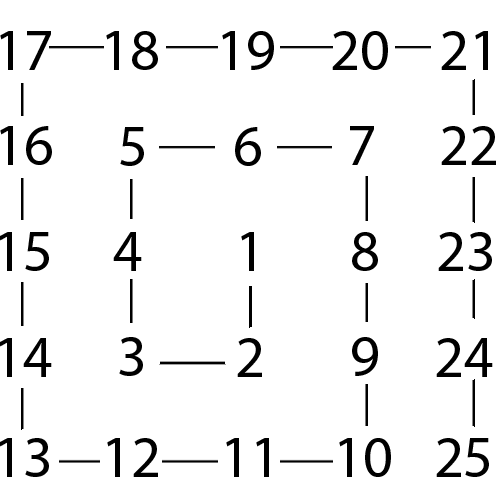

*Author: Aloysius*


Mumen Rider is in the depths of the Monster Association underground base in an attempt to save Waganma, who was kidnapped by monsters. He came across a series of rooms with tiles that form a $n$ x $n$ grid. Some of the tiles will break and cause him to fall to his death and some tiles are safe for him to step on. His objective is to cross these series of rooms in order for him to find Waganma and save him. On the wall, it is written 'Ulam Spiral'. From this, Mumen Rider recalled from college what an Ulam Spiral was...

The Ulam Spiral is a spiral of dots and spaces, where prime numbers are marked by dots and other numbers by spaces.<br />

For example, we'll construct a spiral with size `5`.

We can start constructing this spiral with all numbers shown.<br />
<strong>Take note of the direction of this spiral</strong>




Next, we will remove numbers that are not prime.<br />


Then, all of the prime numbers will be replaced with dots and the non-prime numbers will be replaced with blanks.<br />

```
-------
|o o  |
| o o |
|    o|
| oo  |
|o o  |
-------
```

With this knowledge, Mumen Rider finally knew how to safely get to the other side to continue his search.

### Input
Your input is an <strong>odd</strong> number, $n$, which will determine the size of the spiral

### Constraint
$1 \leq n \leq 200$

### Output
Print the spiral, encased in borders

<hr />

#### Sample Input
```
5
```

#### Sample Output

```
-------
|o o  |
| o o |
|    o|
| oo  |
|o o  |
-------
```